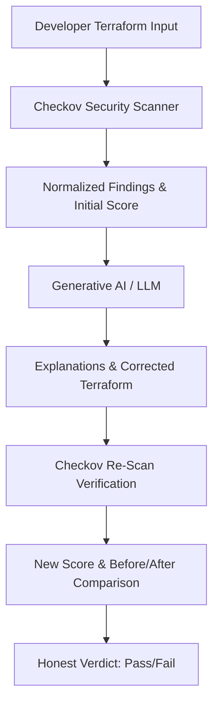
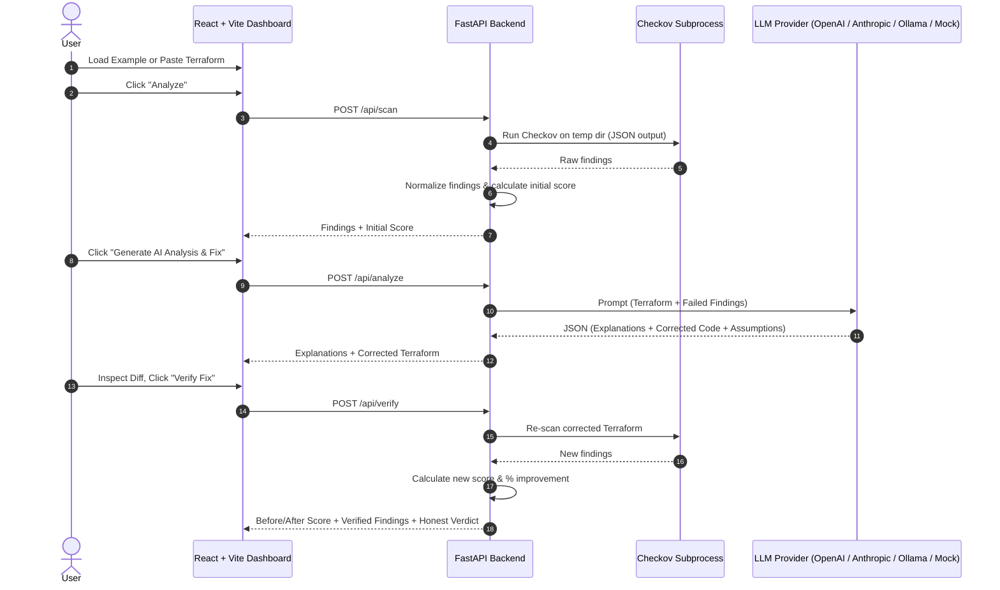

# AI-IaC Guard

> **Generative AI for Automated Infrastructure-as-Code Security**  
> Detect → Explain → Remediate → Verify

AI-IaC Guard is an end-to-end, static-analysis-driven cybersecurity tool that demonstrates a trustworthy, closed-loop workflow for securing Infrastructure-as-Code (Terraform).

---

## The Core Concept: "Trust, but Verify"

Generative AI can hallucinate, introduce syntax issues, or swap one misconfiguration for another. For this reason, **AI-IaC Guard never blindly trusts LLM remediation**.

Instead, it enforces a **Detect → Explain → Remediate → Verify** pipeline:



The corrected Terraform is **never** presented as fixed until Checkov has scanned it a second time and verified the reduction in findings.

---

## Architecture & Data Flow



---

## Key Features

- **Real Checkov Integration:** Directly runs the official Checkov static analysis engine in isolated temporary directories.
- **Provider-Agnostic LLM Layer:** Supports OpenAI, Anthropic, local Ollama, and an automatic clearly-labeled Mock mode.
- **Strict Zero-Trust AI Remediation:** AI output is treated as untrusted code until verified by a secondary Checkov scan.
- **Project-Specific Security Scoring:** Deterministic 0–100 scoring model with transparent breakdown and percentage improvement.
- **Side-by-Side Diff Viewer:** Inspect original vs. corrected Terraform with copy and download utilities.
- **One-Click Vulnerable Demos:** Built-in scenarios for S3, Security Groups, and IAM.
- **Zero Real Cloud Footprint:** Static analysis only—never provisions infrastructure, never runs `terraform apply`, and never requires cloud credentials.
- **CI/CD Pipeline Guardrails:** GitHub Actions workflow running Checkov with configurable severity failure thresholds.

---

## Security Scoring Formula & Honest Labeling Caveat

> ⚠️ **IMPORTANT DISCLAIMER:**  
> The Security Score is a **project-specific, heuristic metric** computed solely from Checkov findings detected in this specific scan. It is **NOT** an industry-standard security rating (such as CVSS, CIS Benchmark score, or ISO rating). A score of 100 indicates that no findings were flagged by the configured Checkov policies for this input—it does **NOT** constitute a guarantee of 100% security in a production runtime environment.

### Mathematical Formula

The score begins at a base of `100.0` points. Deductions are subtracted for each failed Checkov check:

| Severity | Deduction per finding |
|---|---|
| **CRITICAL** | `-25 points` |
| **HIGH** | `-15 points` |
| **MEDIUM** | `-8 points` |
| **LOW** | `-3 points` |
| **UNRATED** | `-5 points` |
| **INFO** | `-1 point` |
| **PASSED** | `0 points` |

$$\text{Score} = \max\left(0.0, \, \min\left(100.0, \, 100 - \sum \text{Deductions}\right)\right)$$

### Improvement Percentage

$$\text{Improvement} = \frac{\text{Score}_{\text{after}} - \text{Score}_{\text{before}}}{\text{Score}_{\text{before}}} \times 100\%$$

*(If the initial score is `0`, improvement is reported as `+100%` if the new score is positive, or `0%` if unchanged).*

---

## Tech Stack

- **Frontend:** React 19, Vite, Tailwind CSS, Lucide Icons, JetBrains Mono font.
- **Backend:** Python 3.12+, FastAPI, Pydantic v2, Uvicorn, HTTPX.
- **Security Scanner:** Checkov 3.x CLI.
- **AI Integrations:** OpenAI API, Anthropic API, Ollama (local), or Mock fallback.
- **CI/CD:** GitHub Actions (`.github/workflows/security.yml`).
- **Containerization:** Docker & Docker Compose.

---

## Project Structure

```
AI-IaC-Security-Assistant/
├── backend/
│   ├── app/
│   │   ├── api/
│   │   │   └── routes.py           # FastAPI routes (/api/scan, /api/analyze, /api/verify, etc.)
│   │   ├── models/
│   │   │   └── schemas.py          # Pydantic request/response models
│   │   ├── services/
│   │   │   ├── checkov_service.py  # Checkov CLI subprocess execution & normalization
│   │   │   ├── llm_service.py      # Provider abstraction (OpenAI, Anthropic, Ollama, Mock)
│   │   │   ├── remediation_service.py # Orchestrator for Scan-Analyze-Verify lifecycle
│   │   │   └── scoring_service.py  # 0-100 score calculator & delta metrics
│   │   ├── utils/
│   │   │   └── file_utils.py       # Safe isolated tempdir management
│   │   └── main.py                 # FastAPI app entry point & CORS configuration
│   ├── tests/
│   │   └── test_main.py            # Comprehensive pytest test suite (27 unit & integration tests)
│   ├── Dockerfile
│   └── requirements.txt
├── frontend/
│   ├── src/
│   │   ├── components/
│   │   │   ├── AIAnalysisPanel.jsx # Finding explanation cards & assumptions
│   │   │   ├── FindingsList.jsx    # Filterable Checkov findings cards
│   │   │   ├── ScoreDisplay.jsx    # Circular score gauge & comparison view
│   │   │   ├── SeverityBadge.jsx   # Color-coded severity indicators
│   │   │   └── TerraformDiff.jsx   # Original vs Corrected Terraform diff viewer
│   │   ├── services/
│   │   │   └── api.js              # Client-side API caller
│   │   ├── App.jsx                 # Main application dashboard
│   │   ├── index.css               # Cybersecurity dark-mode design system
│   │   └── main.jsx
│   ├── Dockerfile
│   ├── nginx.conf
│   ├── package.json
│   └── vite.config.js
├── examples/
│   ├── vulnerable-s3/              # S3 bucket: public ACL, missing encryption, logging, versioning
│   ├── vulnerable-security-group/  # SG: 0.0.0.0/0 on port 22 (SSH) and 3389 (RDP)
│   └── vulnerable-iam/             # IAM: wildcard Action="*", unrestricted AssumeRole
├── .github/workflows/
│   └── security.yml                # CI/CD security gate with configurable severity thresholds
├── .env.example                    # Template for environment configuration
├── .gitignore                      # Ignore rules for secrets, state, and dependencies
├── docker-compose.yml              # Single-command containerized stack
└── README.md
```

---

## Installation & Setup

### Prerequisites

- **Python 3.11+**
- **Node.js 18+** and `npm`
- **Checkov** (`pip install checkov`)

### 1. Environment Configuration

Copy the example `.env` file to `.env`:

```bash
cp .env.example .env
```

Configure your LLM settings in `.env`:

```env
# Choose: mock | openai | anthropic | ollama
LLM_PROVIDER=mock

# Required if using openai or anthropic:
LLM_API_KEY=your_secret_key_here

# Optional model override:
# LLM_MODEL=gpt-4o-mini
```

> **Security Guarantee:** The backend is the only layer that accesses `.env` or reads API keys. No secrets are ever passed to the frontend bundle or client network calls.

### 2. Running the Backend

From the repository root:

```bash
cd backend
python3 -m uvicorn app.main:app --reload --port 8000
```

Backend interactive API documentation will be available at:  
👉 **http://localhost:8000/docs**

### 3. Running the Frontend

In a separate terminal:

```bash
cd frontend
npm install
npm run dev
```

Open your browser at:  
👉 **http://localhost:5173**

---

## Running with Docker Compose

To launch both the frontend and backend with a single command:

```bash
docker-compose up --build
```

- Frontend: **http://localhost:5173**
- Backend: **http://localhost:8000**

---

## The 5-Minute Live Presentation Demo

Follow this exact walkthrough during demos and presentations:

1. **Open Dashboard:** Navigate to `http://localhost:5173`. Point out the header indicator showing Checkov ready and the active LLM mode.
2. **Load Scenario:** Click the **"🪣 Vulnerable S3 Bucket"** button under Section 1 (Terraform Input). Note the public read ACL, missing encryption, and lack of logging.
3. **Run Scan:** Click **"Analyze"**. Checkov executes against an isolated temporary directory.
4. **Inspect Findings:** Section 2 populates with Checkov results (e.g., `CKV_AWS_20`, `CKV_AWS_19`, `CKV_AWS_18`) and an initial security score (e.g., `20/100`).
5. **Request AI Remediation:** Click **"Generate AI Analysis & Fix"**. The LLM produces plain-English explanations of what the risk is, why it matters, potential attack vectors, and specific remediation advice.
6. **Compare Code:** Review Section 4 (Remediation). Use the **Split View** to observe how the AI added SSE encryption, public access block resources, and versioning. Point out the reminder: *"The corrected code below has NOT yet been re-scanned."*
7. **Verify the Fix:** Click **"Verify Fix"**. Checkov re-scans the corrected Terraform code.
8. **View Score Improvement:** Section 6 reveals the Before vs. After score comparison (e.g. rising from `20` to `100`), with an honest verdict stating: *"Passed all configured Checkov security checks for this scan."*
9. **Show CI/CD Guardrail:** Point to `.github/workflows/security.yml` to demonstrate how identical checks enforce pipeline failure on `CRITICAL > 0` before vulnerable code reaches production.

---

## CI/CD Pipeline (GitHub Actions)

The workflow in `.github/workflows/security.yml` checks out the repository, installs Checkov, scans the `examples/` directory, and fails the build if security thresholds are breached.

### Adjusting Severity Thresholds

In `.github/workflows/security.yml`, adjust the environment variables:

```yaml
env:
  FAIL_ON_CRITICAL: 0    # Fails if CRITICAL count > 0 (zero tolerance)
  FAIL_ON_HIGH: 0        # Fails if HIGH count > 0 (set to 9999 to allow HIGHs)
```

---

## Running Tests

Execute the backend pytest suite covering scoring logic, Checkov output parsing, Pydantic schema validation, LLM response parsing, and error paths:

```bash
pytest backend/tests -v
```

All 27 automated tests run locally in under 1 second without requiring external network calls.

---

## Limitations & Future Work

- **Static vs. Dynamic Analysis:** Static analysis inspects declarative HCL files; it does not analyze live AWS IAM policies, SCPs, or runtime configuration drift.
- **Provider Coverage:** Currently optimized for AWS Terraform resources; Azure and GCP policies are supported natively by Checkov but may require prompt tailoring for best LLM remediation results.
- **Context Size:** Very large multi-module Terraform configurations should be broken down into individual resource modules before submitting for AI analysis.

# AI-IaC-Security-Assistant
